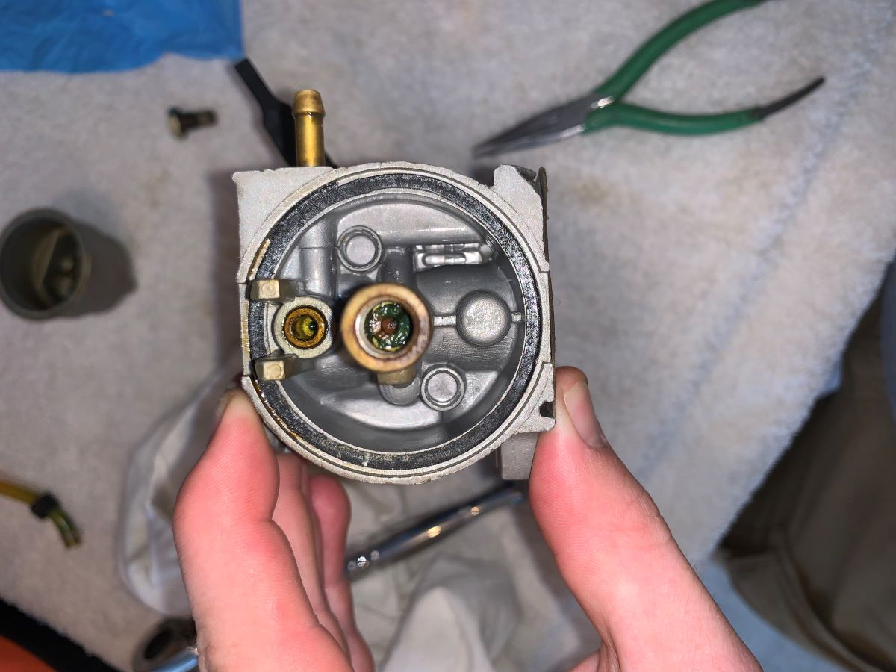

## The Problem
My parents have had a gas generator for almost 15 years. They got it after a freak snowstorm (Snowmageddon 2010) knocked out power to the neighborhood for the better part of a week. They've used it very sporadically since then, typically just to run the spare fridge if power goes out for more than a couple of hours. 

Recently, we tried to fire it up and couldn't get it to start. By all accounts, this tends to be an issue with generators that are infrequently used. Old fuel sits in the carburetor and gunks it up over time. 

My dad is about ready to just get rid of the thing. I figure even if I have to replace the entire carburetor, the generator still has plenty of value and could end up being very useful in Michigan. Plus, I've had next to no experience with this kind of work, so it should be good practice.

## Teardown
So far, I've followed a couple YouTube videos to tear down the carburetor. Of course, I fell victim to the common pitfall of stripping out the main jet. You can see it slightly out-of-focus in the center of the image below. The brass jet often becomes stuck and its screw slot easily strips. I already have a screw extractor on order so I can get the thing out. 

Other than that, things are looking up. The bottom bolt is hollow and has a pair of transverse through holes. Both were completely clogged with rust and grime, so that alone could have been the culprit. The main jet is also quite disgusting, though, so hopefully a brand new one will make a ton of difference as well.

## Next Steps
Once the extractor bit comes in, I have to remove the main jet and clean the emulsion tube. Then I have to figure out where to find a replacement jet. Hopefully once I have that, I can reassemble the thing and the generator will start up.