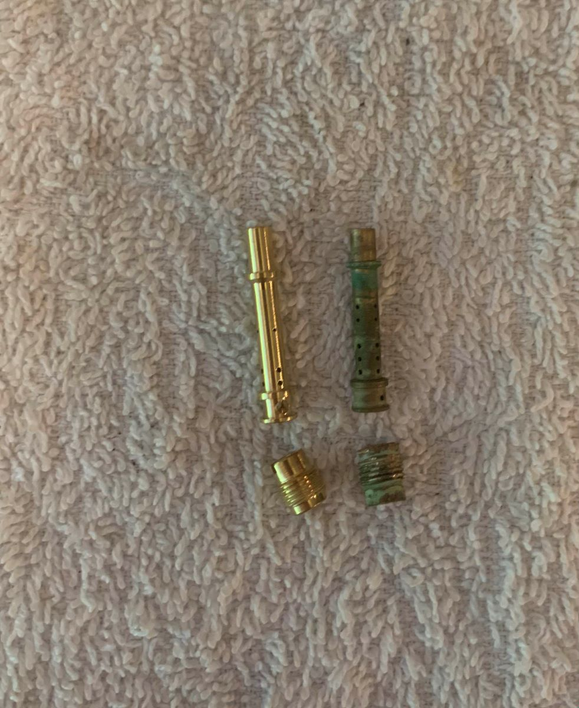

# Generator Repair, Part 2
## Teardown, Continued
I managed to extract the main jet after drilling out its center bore and using a tapered extraction bit. In doing so I drilled into the emulsion tube, which was annoying. Thankfully, most of the carburetor repair kits came with a main jet and multiple emulsion tubes, so it wasn't a big deal. Check out the corroded jet and emulsion tube below.

## Reassembly
The new jet and emulsion tube aren't a perfect match, but most of these aftermarket parts seem to be for tuning go-kart engines. I figure my generator should be okay running at a slightly sub-optimal mix though. The new and old parts are shown side-by-side below. They are laid on a shop rag, so those are towel fibers for scale. These parts are quite small. The smallest holes can only be cleared with a sewing needle. No wonder they clog up easily.

## Moment of Truth?
I replaced the emulsion tube and main jet with the new parts and carefully reassembled the generator. I opened the fuel line valve and immediately saw gasoline spilling out of the bowl of the carb. I suspected the gaskets were probably too far gone to be reused but I had tried anyway. No matter, they could be replaced for a couple bucks too.

By the time I got back in town from my golf trip, the replacement gaskets had shown up. I replaced every seal and gasket I could and rebuilt the generator again. This time, no leaks. It fired right up and ran smoothly. I read online to close the fuel line and let it run itself dry so it doesn't sit with a bunch of fuel in the carburetor. Hopefully that prevents the problem in the future.